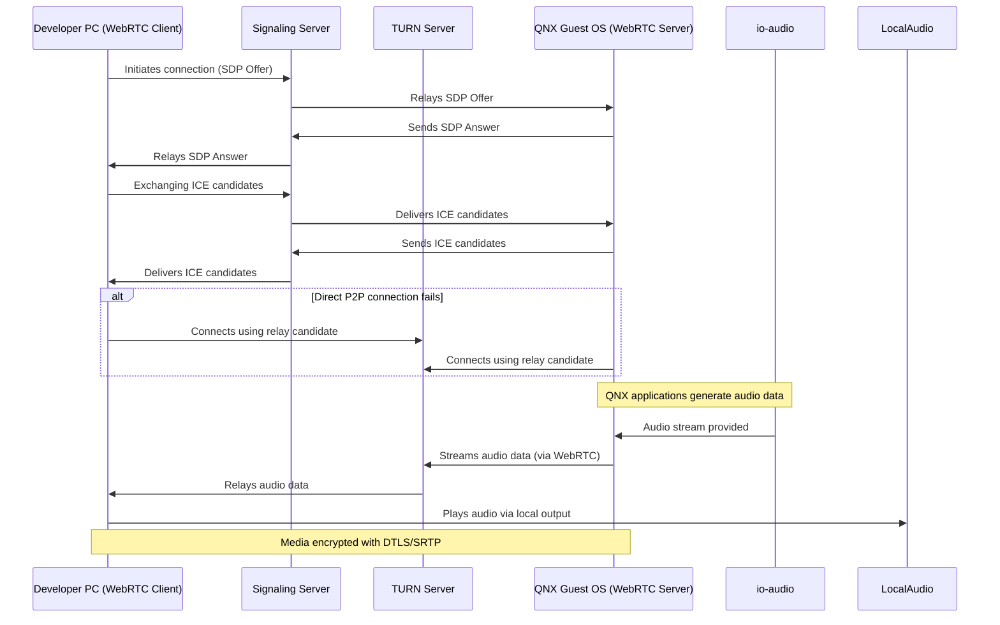

# Standalone QNX VM Virtualization

## Overview
This document outlines the architecture and setup for a **Standalone QNX Virtual Machine (VM)** running on a Linux host using QEMU/QNX hypervisor. It enables real-time audio streaming from QNX guest applications to a developer's browser via WebRTC.

## Assumptions
The architecture is based on the assumption that the WebRTC server, including TURN and signaling servers, is provided by QNX.

---

## Architecture Components

## QNX Audio Use Case
MBCC QNX supports both Instrument Cluster (IC) apps and Safety apps, enabling playback of various chime audio types critical for driver awareness and vehicle feedback.

### 1. **Non-Safety Audio**
- Chime audio
- QNX utilities:  Wave, Aplay, WaveRec, ARecord, AMixer
### 2. **Safety Audio**

- Includes alerts that meet ASIL A/B safety standards
- Examples: Seat Belt Warning, Lane Departure, Blind Spot Detection
### 3. **Early Audio**

-  Played during system boot-up or welcome animations before full OS initialization
## Architecture Components
### 1. **Linux Host**
- Base OS that runs the virtualization stack.
- Hosts the QEMU/QNX hypervisor.

### 2. **QEMU/QNX Hypervisor**
- Virtualization layer that manages the QNX Guest OS.
- Provides isolation and resource management.

### 3. **QNX Guest OS**
Contains the following components:
- **native-apps**: Standard QNX applications.
- **Cluster apps**: Intelligent cockpit cluster applications.
- **Safety apps**: Safety-critical applications.
- **io-audio**: QNX audio manager service. Manages audio I/O and routes audio streams.
- **WebRTC Server**: Streams audio data to external clients using WebRTC.
- **Signaling Server**: Facilitates WebRTC session negotiation.
- **TURN Server**: Relays media when direct peer-to-peer connection is not possible.

### 4. **Developer PC**
- Runs a **WebRTC client** (e.g., Chrome browser).
- Connects to the QNX-hosted signaling and TURN servers.
- Receives and plays audio streamed from the QNX Guest OS.

### 5. **Local Audio Output**
- Audio output device (e.g., speakers/headphones) connected to the Developer PC.

---

## Data Flow

1. Applications in the QNX Guest OS generate audio data.
2. `io-audio` captures and processes the audio.
3. The **WebRTC server** streams the audio.
4. The **Signaling server** handles session negotiation with the Developer PC.
5. If direct connection fails, the **TURN server** relays media traffic.
6. The **WebRTC client** (Chrome browser) receives and plays the audio via local output.

## WebRTC Connectivity and TURN Server Integration

**WebRTC** enables secure, real-time audio streaming between the QNX Guest OS and the Developer PC, even when network conditions (such as NAT or firewall traversal) complicate direct peer-to-peer connections. To ensure reliable connectivity:

### Signaling Server
- **Role**: Facilitates the initial connection setup by exchanging connection information (SDP, ICE candidates) between the QNX WebRTC server and the Developer PC’s WebRTC client.
- **Provided by QNX**: This server coordinates session initiation but does not handle media data.

### TURN Server (Traversal Using Relays around NAT)
- **Purpose**: When direct peer-to-peer connection is blocked (e.g., by firewalls or symmetric NAT), the TURN server relays media streams between endpoints.
- **Deployment**: The TURN server runs alongside the signaling server, either within the QNX Guest OS or as a separate component in the infrastructure.
- **Configuration**:
  - The QNX WebRTC server and the Developer PC’s WebRTC client are both configured with the TURN server’s address and credentials.
  - During ICE negotiation, if a direct connection fails, traffic is routed via the TURN server to maintain uninterrupted audio streaming.
- **Benefits**:
  - **Reliability**: Ensures connectivity across different network topologies.
  - **Security**: Media streams are encrypted end-to-end using DTLS/SRTP.

### Connectivity Sequence

---

## Additional Notes

- **Firewall Considerations**: Ensure ports required for signaling and TURN are open and accessible.
- **Security**: Use secure signaling (e.g., WSS) and TURN with authentication.
- **Performance**: TURN servers should be robust enough to handle the anticipated media bandwidth.

---
